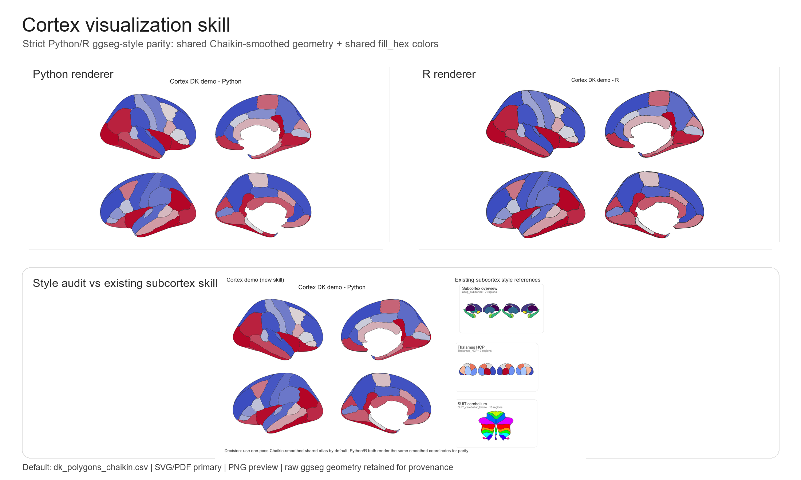
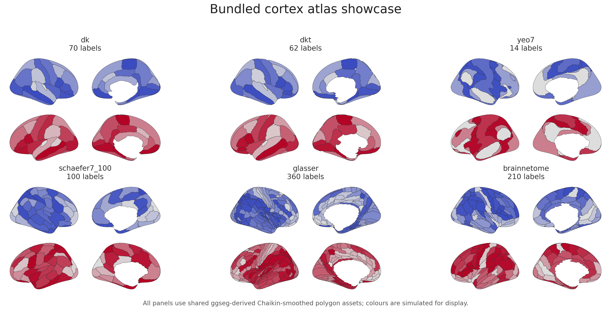

# cortex-visualization skill

[](#)
[](#)
[](#)
[](https://github.com/mqqq333/cortex-visualization-skill/actions/workflows/validate.yml)

Codex skill for reproducible 2D cortical atlas visualizations with Python/R dual backends, ggseg-derived polygon assets, and subcortex-style SVG/PDF outputs.



<p align="center"><em>Locally generated cortex showcase: Python and R render the same Chaikin-smoothed ggseg-derived geometry and shared colours.</em></p>



<p align="center"><em>Bundled ggsegverse-derived cortex atlas assets rendered with the same flat, matte, Chaikin-smoothed visual contract.</em></p>

This repository contains an interactive Codex skill for cortical region-level visualization. It guides an agent through backend choice, environment checks, atlas geometry selection, ROI label validation, Python/R parity rendering, style QC, and Methods/caption provenance.

> This repository is an agent skill layer, not a fork or replacement of R `ggseg`, `ggseg3d`, `python-ggseg`, Workbench, FreeSurfer, or Nilearn. It does not vendor the ggseg paper PDF.

## What it helps with

- Choose **Python or R** before plotting.
- Use R `ggseg` as the canonical polygon source.
- Choose among bundled ggsegverse-derived cortex atlases, not only DK.
- Render cortical atlas maps from ROI tables.
- Validate ROI labels against shared atlas geometry.
- Produce strict Python/R visual parity via shared polygon CSV and shared `fill_hex` colours.
- Use one-pass Chaikin-smoothed display geometry for a smoother subcortex-like cortex style.
- Export editable SVG/PDF figures with PNG previews.
- Troubleshoot jagged boundaries, unmatched labels, or Python/R mismatches.
- Write concise Methods, captions, and provenance notes.
- Maintain an upstream `python-ggseg` contribution path for shared polygon atlas support.

## Reproduce the showcase

The hero image is generated locally from tracked demo outputs:

```bash
python cortex-visualization/scripts/make_cortex_showcase.py \
  --project-root . \
  --output assets/gallery/cortex_showcase.png
```

The underlying Python/R demo uses the same atlas coordinates and the same prejoined `fill_hex` colours.

The multi-atlas gallery is generated from the bundled atlas CSVs:

```bash
python cortex-visualization/scripts/make_multi_atlas_showcase.py \
  --project-root . \
  --output assets/gallery/multi_atlas_showcase.png
```

## Try it in 30 seconds

Validate and plot the bundled DK demo ROI table:

```bash
python cortex-visualization/scripts/check_cortex_environment.py --backend python
python cortex-visualization/scripts/validate_cortex_table.py \
  --input cortex-visualization/assets/examples/dk_demo_values.csv \
  --atlas-csv cortex-visualization/assets/atlases/dk_polygons_chaikin.csv \
  --match-column label \
  --value-column value \
  --strict
python cortex-visualization/scripts/plot_cortex_table.py \
  --input cortex-visualization/assets/examples/dk_demo_values.csv \
  --atlas-csv cortex-visualization/assets/atlases/dk_polygons_chaikin.csv \
  --output-prefix demo/cortex_dk_demo_python \
  --match-column label \
  --value-column value \
  --vmin -1 --vmax 1 --midpoint 0 \
  --formats png,svg,pdf \
  --write-plot-data demo/cortex_dk_demo_plot_data.csv
```

Render the same plot-data table from R for strict visual parity:

```bash
Rscript cortex-visualization/scripts/plot_cortex_table.R \
  --plot-data demo/cortex_dk_demo_plot_data.csv \
  --output-prefix demo/cortex_dk_demo_r \
  --formats png,svg,pdf
```

## Quick start

Copy the skill folder into your Codex skills directory:

```text
cortex-visualization/
```

Then ask Codex, for example:

```text
Use the cortex-visualization skill. I have a cortical ROI table and want a DK ggseg-style map.
```

For a first test without real data:

```text
Use the cortex-visualization skill. Generate simulated DK values and make matching Python/R preview figures.
```

## Interaction pattern

The skill follows the same compact figure-design loop as the subcortex skill:

```text
backend -> environment check -> figure contract -> atlas/label validation -> preview/export -> QC -> revision
```

The first question is usually:

```text
Do you want Python or R for the final rendering?
```

Python is better for Python analysis pipelines and batch rendering. R is better for native ggseg export, tidyverse, and ggplot workflows. Exact Python/R parity is achieved by shared polygon geometry plus shared `fill_hex` colours.

## Core visual contract

The cortex figures intentionally match the existing subcortex skill's flat-vector visual language:

- white background;
- matte parcel fills;
- dark outlines;
- no mesh, curvature, lighting, or Workbench-style surface texture;
- SVG/PDF primary outputs;
- PNG previews for quick inspection.

The default display atlas is:

```text
cortex-visualization/assets/atlases/dk_polygons_chaikin.csv
```

It is generated from the raw R ggseg-derived geometry:

```text
cortex-visualization/assets/atlases/dk_polygons.csv
```

using:

```bash
python cortex-visualization/scripts/smooth_polygon_atlas.py \
  --input cortex-visualization/assets/atlases/dk_polygons.csv \
  --output cortex-visualization/assets/atlases/dk_polygons_chaikin.csv \
  --iterations 1 \
  --ratio 0.25
```

The same raw-plus-Chaikin asset pattern is used for every bundled atlas, so
Python and R can render the same geometry and colours regardless of atlas.

## Bundled cortex atlases

The repository now includes representative ggsegverse-derived cortical atlas
assets. See `cortex-visualization/references/atlas_catalog.md` for exact file
names, label counts, source package names, and sizes.

| Atlas | Source | Labels | Best for |
|---|---|---:|---|
| DK | `ggseg::dk` | 70 | default anatomical demo and subcortex-style comparison |
| DKT | `ggsegDKT::dkt` | 62 | FreeSurfer-style anatomical parcels |
| Destrieux | `ggsegDestrieux::destrieux` | 148 | finer anatomical parcellation |
| Yeo7 / Yeo17 | `ggsegYeo2011` | 14 / 34 | canonical functional networks |
| Schaefer7-100 / Schaefer17-100 | `ggsegSchaefer` | 100 / 100 | functional parcellations |
| Glasser | `ggsegGlasser::glasser` | 360 | fine HCP-MMP-style cortical parcels |
| Brainnetome | `ggsegBrainnetome::brainnetome` | 210 | connectivity-oriented parcels |
| Gordon | `ggsegGordon::gordon` | 331 | network/community parcellation |
| Power | `ggsegPower::power` | 130 | functional node/network atlas |

Every bundled atlas has:

```text
cortex-visualization/assets/atlases/<atlas>_polygons.csv
cortex-visualization/assets/atlases/<atlas>_polygons_chaikin.csv
```

Use `*_polygons_chaikin.csv` for final flat-vector figures and keep
`*_polygons.csv` for provenance/debugging.

## Environment support

The skill includes a diagnostic helper:

```bash
python cortex-visualization/scripts/check_cortex_environment.py --backend both
```

Python rendering requires `matplotlib`. R rendering requires `Rscript` plus `ggplot2`; atlas export from R requires `ggseg`/`ggseg.formats` availability.

## Included bundle

```text
cortex-visualization/
|-- SKILL.md
|-- agents/
|   `-- openai.yaml
|-- assets/
|   |-- atlases/
|   |   |-- atlas_catalog.csv
|   |   |-- dk_polygons.csv
|   |   |-- dk_polygons_chaikin.csv
|   |   `-- ... additional ggsegverse-derived atlas CSVs
|   `-- examples/
|       `-- dk_demo_values.csv
|-- references/
|   |-- interactive_workflow.md
|   |-- atlas_catalog.md
|   |-- environment_setup.md
|   |-- workflows.md
|   |-- scene_recipes.md
|   |-- style_contract.md
|   |-- boundary_quality.md
|   |-- troubleshooting.md
|   `-- ...
`-- scripts/
    |-- check_cortex_environment.py
    |-- export_ggseg_atlas.R
    |-- inspect_cortex_atlas.py
    |-- make_cortex_showcase.py
    |-- make_multi_atlas_showcase.py
    |-- plot_cortex_table.py
    |-- plot_cortex_table.R
    |-- smooth_polygon_atlas.py
    `-- validate_cortex_table.py
```

## Demo artifacts

Tracked demo outputs live under `demo/`:

```text
demo/cortex_dk_demo_python.png/svg/pdf
demo/cortex_dk_demo_r.png/svg/pdf
demo/cortex_dk_demo_plot_data.csv
demo/STYLE_AUDIT_cortex_vs_subcortex.png
demo/SMOOTHING_EXPERIMENT_cortex_boundaries.png
```

Gallery images live under `assets/gallery/`:

```text
assets/gallery/cortex_showcase.png
assets/gallery/multi_atlas_showcase.png
assets/gallery/python_r_shared_dk_compare.png
```

## Output philosophy

The skill treats each figure as a visual argument, not a decorative brain icon. It prefers exact atlas labels, validated region names, conservative color scales, shared geometry for reproducibility, editable vector outputs, and explicit provenance.

## Source boundary

This skill was written from public materials for the ggseg ecosystem, including the ggseg homepage, the ggseg/ggseg3d paper, and local experiments comparing R and Python outputs. Build-only local materials and the paper PDF are not intended to be committed unless explicitly needed.

## Upstream contribution

A related `python-ggseg` PR proposes and implements a minimal shared polygon atlas interoperability API:

```text
https://github.com/ggsegverse/python-ggseg/pull/10
```

Local context notes are saved in:

```text
docs/python_ggseg_pr_10_context.md
```

## Star History

[](https://www.star-history.com/#mqqq333/cortex-visualization-skill&Date)

## Citation

If you use the underlying ggseg ecosystem, please cite:

Mowinckel AM, Vidal-Pi?eiro D. Visualization of Brain Statistics With R Packages ggseg and ggseg3d. *Advances in Methods and Practices in Psychological Science*. 2020;3(4):466-483. doi:10.1177/2515245920928009
